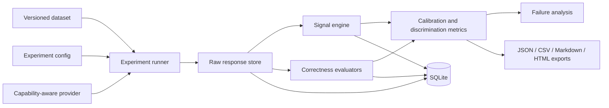

# Mirage

> **Mirage is an evaluation platform for measuring, visualising, and comparing
> uncertainty, calibration, consistency, and factual reliability in large language
> model outputs.**

Mirage is an open, local-first research platform for studying whether uncertainty
signals predict labelled factual errors. It connects raw provider outputs to
versioned datasets, deterministic correctness evaluators, calibration metrics,
selective-prediction analysis, failure exploration, and reproducible exports.

Mirage is not a truth oracle and is not positioned as a guaranteed hallucination
detector.

## Research motivation

Mirage is designed to answer questions such as:

- Which available uncertainty signal best separates correct and incorrect answers?
- Does semantic disagreement correlate with factual error?
- When is a model confidently wrong?
- How much human review is required to reach a target selective accuracy?
- How do prompts, decoding settings, models, and retrieval configurations change
  reliability?

The included starter study uses cached model outputs so the complete evaluation
pipeline can run on a CPU-only laptop. It is clearly labelled demonstration data and
must not be interpreted as a newly executed model benchmark.

## Interface

The responsive research interface contains:

```text
Overview → Playground → Experiments → Datasets → Compare
         → Calibration → Failures → Reports → Methodology
```

The application provides interactive reliability diagrams, risk-coverage curves,
signal-comparison tables, raw-output traces, failure slices, and experiment exports.
Run it locally to view the current v2 interface; the public deployment may represent
an earlier pushed version because this iteration is intentionally local-only.

## What Mirage measures

- Provider-native token uncertainty, only when actual log-probabilities exist
- Semantic entropy over sampled-response groups
- Exact and semantic response consistency
- Answer-switch rate
- Numerical variance and entity disagreement
- Structured model self-verification as a fallible signal
- Retrieval claim support when a retrieval provider is configured
- Correlation between each available signal and labelled incorrectness
- Calibration and selective-prediction behavior

## What Mirage does not claim

> Mirage does not determine whether an answer is factually correct solely from model
> uncertainty. It evaluates whether selected uncertainty and consistency signals
> correlate with labelled errors on a defined dataset. Results depend on the dataset,
> model, evaluator, prompt, and sampling configuration.

High model confidence does not guarantee correctness. Low confidence does not prove
hallucination. Meaning-level agreement can be consistently wrong. Model
self-verification is not independent ground truth.

## Architecture



### Backend

- FastAPI and Pydantic v2
- Versioned experiment schema (`2.0`)
- SQLite local persistence and migration registry
- Deterministic experiment identifiers
- Provider capability abstraction
- JSON/JSONL dataset validation
- Correctness, calibration, discrimination, and risk-coverage engines
- Human-label overrides that preserve the automated label
- Structured logging and safe API errors

### Frontend

- React, TypeScript, and Vite
- Recharts for data-driven visualisation
- Responsive research navigation and accessible controls
- Connected experiment, dataset, calibration, failure, and report workflows

## Evaluation pipeline

1. Load and validate a versioned labelled dataset.
2. Load a provider and inspect its capability flags.
3. Generate or read a primary response and multiple sampled responses.
4. Preserve raw output, usage, latency, provider metadata, and errors.
5. Calculate only signals supported by the provider.
6. Evaluate correctness independently from uncertainty.
7. Combine available signals into an explicitly experimental Mirage Risk Score.
8. Compare risks with incorrectness labels.
9. Calculate discrimination, calibration, and selective-prediction metrics.
10. Store the record and export a reproducibility report.

One failed example is stored as a per-example error and does not automatically turn
into a valid result.

## Metrics

### Deterministic correctness

- Normalised exact match
- Acceptable-answer matching
- Token F1
- Numerical tolerance
- Explicit unanswerable/premise-rejection evaluation
- Preserved automated and human labels

### Uncertainty and consistency

Semantic entropy is calculated from response-cluster probabilities:

```text
H = -Σ p(c) log p(c)
```

The current CPU-safe fallback uses token-set Jaccard grouping and labels every
cluster `lexical_fallback_jaccard`. It is not presented as neural NLI or embedding
clustering.

The cached provider does not expose token log-probabilities. Mirage therefore returns:

```text
token_uncertainty = null
reason = "Provider did not return log probabilities."
```

It never invents token probabilities.

### Calibration and discrimination

- AUROC, with incorrectness as the positive class
- AUPRC
- Expected Calibration Error
- Brier score
- Negative log-likelihood
- Reliability bins
- Confidence/risk distribution data
- Risk-coverage curve
- Selective accuracy and error rate
- Review rate at each risk threshold

Calibration receives a visible warning when fewer than 30 labelled examples are
available.

## Dataset format

Mirage accepts JSON arrays, JSONL, or manifests containing an `examples` array:

```json
{
  "id": "fact_001",
  "question": "Who wrote The Old Man and the Sea?",
  "reference_answer": "Ernest Hemingway",
  "acceptable_answers": ["Hemingway", "Ernest Miller Hemingway"],
  "unanswerable": false,
  "domain": "literature",
  "difficulty": "easy",
  "source": "manually_verified",
  "tags": ["closed_book", "entity"],
  "metadata": {}
}
```

The bundled `mirage-starter` dataset spans factual knowledge, science, history,
geography, medicine, law, finance, technology, ambiguity, unanswerable prompts,
false premises, time-sensitive prompts, numerical questions, and multi-hop questions.
It is a demonstration dataset, not a definitive benchmark.

Uploaded datasets are validated before being saved to `data/datasets/`. User-supplied
licensing remains the user's responsibility.

## Provider interface

Every provider declares:

```python
supports_logprobs: bool
supports_seed: bool
supports_streaming: bool
supports_vision: bool
supports_retrieval: bool
supports_token_usage: bool
```

The local iteration implements a cached demonstration provider. Its output records
are real repository data, but no current model inference is claimed. The abstraction
supports adding OpenAI-compatible APIs, Ollama, Hugging Face, or other hosted
providers without changing the evaluation schema.

## Local installation

Requirements:

- Node.js 20+
- Python 3.11+
- npm

```bash
git clone https://github.com/aashita-46/Mirage-LLM.git
cd Mirage-LLM
npm install
python -m pip install -r requirements.txt uvicorn pytest httpx
```

Terminal 1:

```bash
python -m uvicorn api.index:app --reload --port 8000
```

Terminal 2:

```bash
npm run dev
```

Open `http://localhost:5173`.

## Docker

```bash
docker compose up --build
```

Open `http://localhost:8080`. The named `mirage-data` volume preserves local SQLite
records and uploaded datasets.

## Running an experiment

### Interface

Open **Experiments**, choose a dataset and sample count, then select **Run
evaluation**. The saved record becomes available in Compare, Calibration, Failures,
and Reports.

### Command line

```bash
python scripts/evaluate.py --config config/starter-experiment.json
```

Or:

```bash
python scripts/evaluate.py --name "My study" --samples 8 --export markdown
```

Exports are written to `data/exports/`.

## Reproducibility

Each experiment stores:

- Deterministic experiment ID
- Mirage schema version
- Dataset name and version
- Provider, model, and capability flags
- Prompt and system prompt
- Temperature, top-p, maximum tokens, seed, and sample count
- Signal configuration and composite-score weights
- Evaluator configuration
- Retrieval configuration
- Raw responses and sampled responses
- Raw-output SHA-256 trace
- Per-example metrics, correctness, errors, latency, usage, and failures
- Aggregate metrics and small-sample warnings
- Original and optional human labels

The deterministic ID is derived from the schema, dataset identity, and complete
experiment configuration. Repeating an identical configuration replaces the local
record rather than creating a misleading duplicate.

## Exports

Saved experiments can be exported as:

- JSON
- CSV
- Markdown
- HTML

Exports do not include API keys. PDF export is not claimed.

## API

```text
GET    /api/v1/health
GET    /api/v1/system
GET    /api/v1/models
GET    /api/v1/datasets
GET    /api/v1/datasets/{name}
POST   /api/v1/datasets/validate
POST   /api/v1/datasets
POST   /api/v1/analyse
GET    /api/v1/experiments
POST   /api/v1/experiments
GET    /api/v1/experiments/{id}
DELETE /api/v1/experiments/{id}
POST   /api/v1/experiments/{id}/examples/{example_id}/override
GET    /api/v1/experiments/{id}/export
POST   /api/v1/experiments/compare
```

Interactive API documentation is at `http://localhost:8000/api/docs`.

## Tests

```bash
python -m pytest -q
npm test
npm run lint
npm run build
npm audit --audit-level=high
```

Backend tests cover text normalisation, aliases, token F1, numerical tolerance,
semantic-cluster contracts, AUROC, AUPRC, ECE, Brier score, risk coverage,
unavailable log-probabilities, deterministic IDs, persistence, human-label
preservation, validation failures, provider failures, API experiment creation, and
exports.

## Adding a model provider

1. Implement a provider with `generate(example, sampling_config)`.
2. Return a `GenerationRecord` containing raw responses, usage, latency, and errors.
3. Declare exact `ProviderCapabilities`.
4. Return log-probabilities only when they come from the provider.
5. Register the provider in the API model list and runner.
6. Add a provider-independent integration test.

Do not infer unsupported capabilities from a model name.

## Adding a dataset

Use the Datasets interface or add a validated manifest to `data/datasets/`. Include
reference answers or set `unanswerable: true`. Document source and licensing. Do not
store actionable professional medical or legal advice as a casual benchmark.

## Methodology references

- Kuhn et al. (2023), [Semantic Uncertainty: Linguistic Invariances for Uncertainty
  Estimation in Natural Language Generation](https://arxiv.org/abs/2302.09664)
- Guo et al. (2017), [On Calibration of Modern Neural
  Networks](https://proceedings.mlr.press/v70/guo17a.html)
- Geifman and El-Yaniv (2017), [Selective Classification for Deep Neural
  Networks](https://arxiv.org/abs/1705.08500)
- Lin et al. (2022), [Teaching Models to Express Their Uncertainty in
  Words](https://arxiv.org/abs/2205.14334)

## Limitations

- The bundled provider reads cached outputs; it does not run a current LLM.
- Lexical grouping is weaker than embedding or bidirectional NLI equivalence.
- Self-verification is a model-derived signal and may be confidently wrong.
- The starter dataset is too small for strong calibration conclusions.
- No live retrieval provider is configured, so retrieval faithfulness is unavailable.
- No token log-probabilities are available from the cached provider.
- The experimental composite score is configurable but not universally validated.
- Calibration fitting and train/validation splitting are schema-ready future work;
  no fitted calibrator is claimed in this iteration.
- Results are conditional on dataset, provider outputs, evaluator, prompts, decoding,
  and sampling configuration.

## Roadmap

- OpenAI-compatible and local Ollama provider adapters
- CPU-friendly embedding and NLI clustering
- Retrieval claim extraction and citation precision
- Platt, logistic, and isotonic calibration with strict held-out evaluation
- Dataset import/export and failed-example reruns
- Prompt/config duplication and broader experiment comparison
- Larger licensed datasets and human evaluation
- Conformal risk control and abstention policies

## Citation

If Mirage supports research or teaching work, cite the repository and record the
experiment schema version, dataset version, configuration export, and commit hash.

```bibtex
@software{mirage_reliability_evaluation,
  title = {Mirage: LLM Reliability Evaluation Platform},
  url = {https://github.com/aashita-46/Mirage-LLM},
  version = {2.0}
}
```
