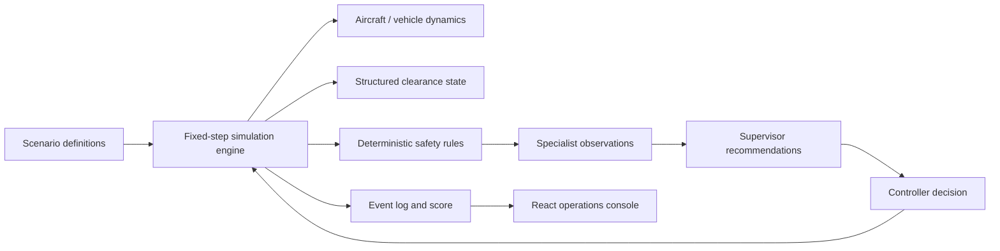

# ATC Guardian

ATC Guardian is an educational air traffic control simulation and multi-agent safety research demonstrator. It models aircraft, vehicles, runway occupancy, structured clearances, pilot readbacks, weather, controller workload, hazards, interventions, and outcomes in a deterministic browser-based environment.

> **ATC Guardian is an educational simulation and research demonstrator. It is not certified for operational air traffic control and must not be used to direct real aircraft or airport vehicles.**

## What works

- Fixed-step, seed-labelled simulation with continuously moving aircraft and vehicles
- Five selectable scenarios: Runway Occupied, Take-off & Crossing, Incorrect Altitude Readback, Weather & Unstable Approach, and High-Workload Cascade
- Timed errors that change actual clearance, target altitude, weather, phase, and vehicle state
- Deterministic runway, ground, communication, weather, and workload detection rules
- Seven visible specialist agents and consolidated, evidence-backed recommendations
- Accept, modify, and reject decisions that change aircraft/vehicle behavior and remain in the event log
- Advisory mode and simulation-only Safety Interlock mode
- Pause, resume, restart, step-forward, and 0.5×–4× speed controls
- Communication transcript, event timeline, decision record, incident escalation, and outcome scoring
- Responsive, keyboard-accessible operations console with reduced-motion support

## Architecture



The domain layer in `src/simulation` has no React dependencies. `types.ts` defines the state contract, `scenarios.ts` owns reproducible scenario fixtures, and `engine.ts` advances movement, injects faults, evaluates rules, coordinates recommendations, applies interventions, and scores outcomes. The React layer renders state and dispatches explicit decisions.

Critical detection does not use an LLM. Geometry and structured state are the source of truth. A future explanation provider may summarize verified observations, but it must never create safety facts or direct real traffic.

## Safety modes

- **Advisory:** findings create recommendations; the simulation never applies a correction without the user.
- **Safety Interlock:** predefined critical simulated clearances are marked blocked immediately. The user can still review and apply the corrective maneuver. This is strictly an educational mechanism inside the simulator.

## Scenario authoring

Add a `Scenario` to `src/simulation/scenarios.ts`. Define initial entity state and one or more `Injection` records with deterministic trigger times. Add reusable handling in `inject()` and state-derived detection in `rules()`; do not put scenario-specific safety logic in React. Every injected error should mutate domain state, have a detection rule, and have an intervention that changes the outcome.

## Local setup

```bash
npm install
npm run dev
```

Open the Vite URL, select **Launch Simulation**, choose a scenario, and press **Simulate**. No external service or API key is required.

## Verification

```bash
npm run lint
npm test
npm run build
```

Unit/integration coverage checks reproducibility, movement-derived conflicts, runway occupancy, readback mismatch, weather rules, interlock behavior, Advisory behavior, and intervention state changes. Component tests cover launch, scenario availability, and lifecycle controls.

## Current limitations

- Airport geometry is a training abstraction, not a surveyed airport layout.
- Kinematics and separation criteria are intentionally simplified and must not be used for operational prediction.
- State replay is deterministic by scenario seed and decision log; a scrubber and persisted snapshot archive are future work.
- Audio, speech recognition, live weather, and operational flight-data providers are not connected.
- Interlock status blocks the simulated clearance record; it does not and cannot interface with real ATC systems.
- Scoring is a transparent equal-weight composite for training feedback, not a validated controller assessment.

## Future integrations

Provider interfaces can be introduced for voice, weather, transcription, aircraft data, and natural-language explanations. Local deterministic implementations must remain the default, secrets must stay server-side, and external model output must never become the safety source of truth.
