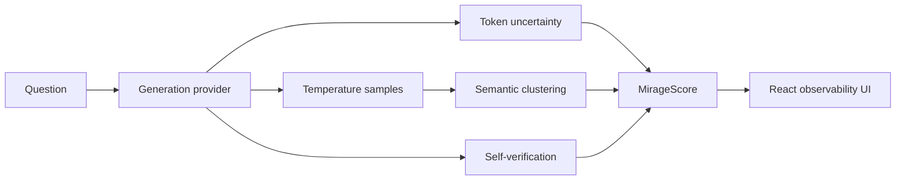

# Mirage

> A live hallucination detector that makes LLM uncertainty visible, measurable,
> and testable—showing where an answer is stable and where it may be an illusion.

Mirage is an interactive AI-observability application for inspecting generated
answers. It combines token-level predictive uncertainty, meaning-level disagreement,
model self-verification, and sensitivity to controlled prompt perturbations. It is
designed to be useful in a zero-download recruiter demo and extensible to local
Hugging Face or external generation providers.

**Mirage estimates observed hallucination risk. It does not independently establish truth.**

## What works

- API-connected question analysis and downloadable reproducibility record
- Token uncertainty heatmap with importance weighting
- Multi-sample semantic clusters and normalised semantic entropy
- P(True) self-verification signal and transparent weighted MirageScore
- Adversarial prompt stress testing and computed stability summary
- Curated reference benchmark with computed AUROC, ECE, Brier score, and reliability bins
- Responsive, accessible interface with reduced-motion support
- Honest cached-demonstration, disconnected, and optional-provider statuses
- FastAPI-compatible API deployable as a Vercel Python function

## Architecture



The repository is deliberately provider-oriented. `api/index.py` contains the
dependency-light demonstration engine and reusable maths. A production provider can
implement `generate`, `generate_with_token_scores`, `sample_many`, and
`verify_answer` without changing the frontend contract.

## MirageScore

The initial uncalibrated blend is:

```text
0.50 × normalised semantic entropy
+ 0.20 × aggregate token uncertainty
+ 0.20 × (1 − P(True))
+ 0.10 × paraphrase instability
```

Missing signals are removed and active weights are renormalised. Token uncertainty is
`0.7 × importance-weighted mean + 0.3 × weighted upper-tail risk`. Numbers, units,
dates, and proper nouns receive higher transparent heuristic weights; function words
and punctuation receive lower weights. This is an uncertainty visualisation, not
mechanistic interpretability.

Semantic entropy groups meaning-equivalent answers, calculates `p(k)=n(k)/N`, then
computes `−Σ p(k)log p(k)`. A production NLI provider should use bidirectional
entailment and connected components at the configured threshold. Connected components
can merge chains that are not fully transitive; this limitation should remain visible.

## Benchmark conventions

The positive class is incorrectness:

```text
target = 1 when the generated answer is incorrect
prediction = MirageScore / 100
```

AUROC is unavailable until both classes are present. Reliability bins compare
predicted hallucination probability with observed incorrectness. The bundled benchmark
is a compact demonstration of the evaluation machinery—not a performance claim about
any external model. The UI displays no leaderboard entry until a run has happened.

## Run locally

Requirements: Node 20+, npm, and Python 3.11+.

```bash
npm install
python -m pip install -r requirements.txt uvicorn pytest httpx
python -m uvicorn api.index:app --reload --port 8000
npm run dev
```

Open `http://localhost:5173`. The Vite server proxies `/api` to FastAPI.

Tests and production build:

```bash
python -m pytest
npm test
npm run lint
npm run build
```

Docker:

```bash
docker compose up --build
```

Then open `http://localhost:8080`.

## Execution modes

- **Cached demonstration** is the default. It uses deterministic, repository-defined
  responses and calculates every visual from those records. It never implies that a
  model ran in the current session.
- **Local model** is an extension point. Configure names in `.env` and install
  `torch`, `transformers`, and an NLI model. Large weights are not downloaded at startup.
- **Groq** is optional. Set `GROQ_API_KEY` only in a local or deployment secret store
  and `GROQ_MODEL` in the environment. Keys must never use the `VITE_` prefix.
- **Fallback/disconnected** keeps the product readable and labels unavailable stages.

## Configuration

Copy `.env.example` to `.env`. Important values include `MIRAGE_MODE`,
`MIRAGE_MODEL_NAME`, `MIRAGE_NLI_THRESHOLD`, limits for samples and tokens, and the
optional Groq variables. Client input cannot select arbitrary local model paths.

## API

- `GET /api/v1/health`, `/system`, `/models`, `/demo/examples`
- `POST /api/v1/analyse`
- `POST /api/v1/stress`
- `POST /api/v1/bench/runs`
- Interactive documentation locally at `/api/docs`

## Limitations and responsible use

- High token confidence does not guarantee correctness; low confidence does not prove hallucination.
- Semantically consistent samples can be consistently wrong.
- P(True) is generated by a model and may be miscalibrated.
- NLI and lexical equivalence systems can misclassify agreement and contradiction.
- Benchmark results depend on data, decoding, scoring, and provider configuration.
- Cached demonstration values are illustrative records, not a report of live inference.
- Mirage is not a medical, legal, or financial decision-maker. Verify important claims
  with authoritative sources and qualified experts.

## Roadmap

Evidence retrieval and citation verification; real bidirectional NLI providers;
quantisation comparisons; ensemble uncertainty; domain calibration; human evaluation;
selective prediction and abstention; conformal risk control; larger licensed benchmark
adapters; and a monitoring SDK.

## Resume-ready description

Built Mirage, an LLM hallucination-risk evaluation interface combining token-level
uncertainty, semantic entropy, self-verification, and adversarial prompt stability.
Developed a FastAPI-compatible and React system with API-backed analysis, computed
benchmark AUROC and calibration metrics, responsive visualisation, and a zero-download
demonstration mode.
